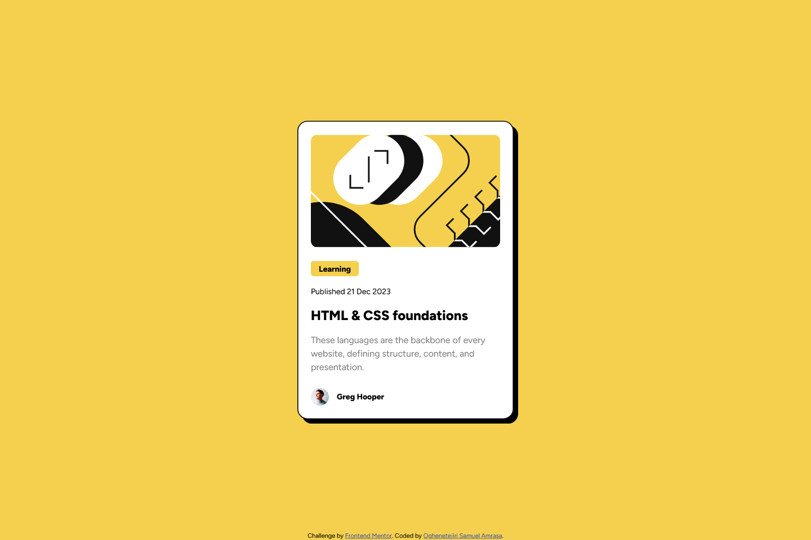

# Frontend Mentor - Blog preview card solution

This is a solution to the [Blog preview card challenge on Frontend Mentor](https://www.frontendmentor.io/challenges/blog-preview-card-ckPaj01IcS). Frontend Mentor challenges help you improve your coding skills by building realistic projects. 

## Table of contents

- [Overview](#overview)
  - [The challenge](#the-challenge)
  - [Screenshot](#screenshot)
  - [Links](#links)
- [My process](#my-process)
  - [Built with](#built-with)
  - [What I learned](#what-i-learned)
  - [Useful resources](#useful-resources)
- [Author](#author)

**Note: Delete this note and update the table of contents based on what sections you keep.**

## Overview

### The challenge

Users should be able to:

- See hover and focus states for all interactive elements on the page

### Screenshot

### Links

- Solution URL: [Add solution URL here](https://github.com/Tejiri-A/blog-preview-card)
- Live Site URL: [Add live site URL here](https://tejiri-blog-preview-card.netlify.app/)

## My process

### Built with

- Semantic HTML5 markup
- CSS custom properties
- Flexbox
- Desktop-first workflow

**Note: These are just examples. Delete this note and replace the list above with your own choices**

### What I learned
I learned how to integrate downloaded fonts into css using font-face.

@font-face {
  font-family: "Figtree";
  src: url(/assets/fonts/Figtree-VariableFont_wght.ttf);
}

### Useful resources

- [Example resource 1](https://stackoverflow.com/questions/67103512/css-font-family) - This helped me import downloaded fonts into css.

## Author

- Frontend Mentor - [@Tejiri-A](https://www.frontendmentor.io/profile/Tejiri-A)

